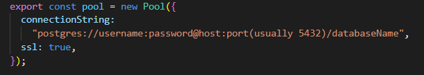

# React Redux Pagination App

This is a simple React app with TypeScript and Redux that fetches items from an API and displays them in a paginated list.

## Features

- **Data Scraping:** The application utilizes web scraping techniques to extract data from `sreality.cz`.
- **PostgreSQL Database:** Scraped data is stored in a PostgreSQL database, providing a structured and persistent storage solution.
- **React Frontend:** A React app with TypeScript and Redux fetches data from the PostgreSQL database and displays it in a paginated list.
- **Pagination:** The app uses ReactPaginate to display items in pages, with a configurable number of items per page.
- **Redux State Management:** Redux is used to manage the state of the application, making it scalable and maintainable.
- **Dockerized:** The application and its dependencies are containerized using Docker, ensuring consistency across different environments.

## Getting Started

1. **Clone the repository:**
   ```
   git clone https://github.com/chapovskii/lx_test.git
   cd lx_test/data-access
   ```

in lx_test/data-access/db-setup.ts change the row to connect to your database:



in the same directory install the dependencies

```
npm install
```

and run the "db-setup.ts" file to create a table which will be used in the app:

```
npx ts-node db-setup.ts
```

after the db is ready to use, you can deploy the app:

```
cd ../
docker-compose up
```

now you can open http://localhost:8080/ in your browser
